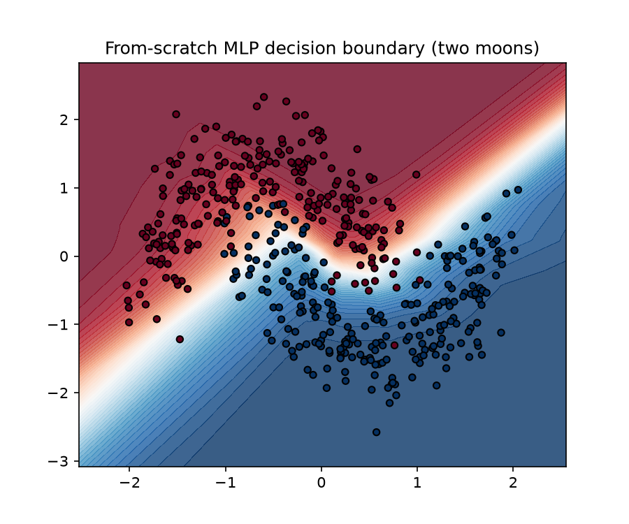
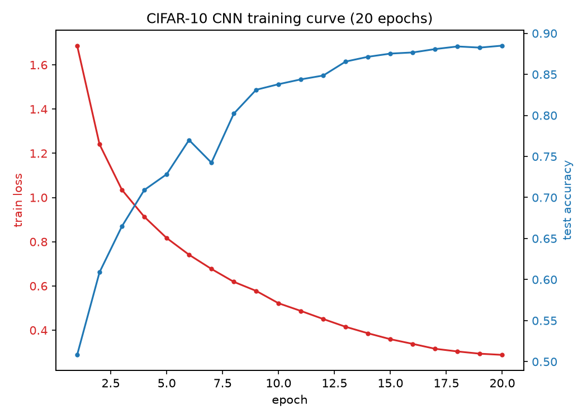

# neural-nets

Two small neural network projects: a from-scratch MLP with manual
backpropagation, and PyTorch CNNs for image classification.

## from_scratch/

A feedforward neural network (`mlp.py`) implemented with nothing but numpy —
forward pass, manually derived gradients, and SGD updates, no autograd.
Trained on the two-moons toy dataset (`train_moons.py`).

```
cd from_scratch && uv run python train_moons.py
```

**Result:** 92.6% training accuracy after 8000 epochs of full-batch gradient
descent. Saves a decision boundary plot to `decision_boundary.png`.



## pytorch_cnn/

Two CNNs built with PyTorch.

**MNIST** (`model.py`, `data.py`, `train.py`) — two conv+pool blocks, trained
for 5 epochs.

```
cd pytorch_cnn && uv run python train.py
```

**Result:** 99.15% test accuracy.

**CIFAR-10** (`cifar_model.py`, `cifar_data.py`, `train_cifar.py`) — three
conv blocks with batchnorm and data augmentation (random crop + flip),
trained for 20 epochs with a cosine-annealed learning rate.

```
cd pytorch_cnn && uv run python train_cifar.py
```

**Result:** 88.5% test accuracy.



Both training scripts download their dataset automatically on first run
(into `pytorch_cnn/data/`, gitignored) and save trained weights as `.pt`
files (also gitignored — rerun the script to regenerate them).

## Setup

```
uv sync
```
